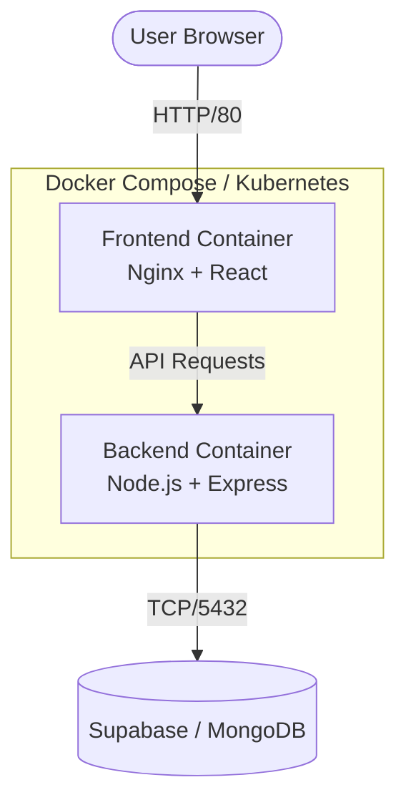

<div align="center">
  <br />
  
  
  
  
  
  
  <h1>AnimeVerse</h1>
  <p>A high-performance, containerized anime streaming platform built with the MERN stack and modern DevOps practices.</p>
</div>

<br />

AnimeVerse is a production-ready, full-stack application inspired by Crunchyroll. It features a modern, responsive UI built with React and Tailwind CSS, powered by a robust Express.js backend and a scalable MongoDB database. The project is designed with best practices in mind, including containerization, microservices architecture, and CI/CD readiness.

---

## ✨ Key Features

### 🖥️ User Experience (Frontend)
- **Modern UI/UX**: Crunchyroll-inspired theme with responsive, glassmorphism design.
- **Anime Catalog**: Advanced search, genre filtering, and curated sections (Trending, Popular, Recently Added).
- **Video Streaming**: Seamless playback via React Player with a "Continue Watching" tracker.
- **Engagement**: Watchlist tracking, likes system, and nested comments/replies on episodes.

### ⚙️ Core & Admin (Backend)
- **Role-based Auth**: Secure JWT-based authentication with bcrypt hashing (User & Admin roles).
- **Admin Dashboard**: Full CMS for managing anime, episodes, and platform statistics.
- **Data Validation**: End-to-end type safety and request validation using Zod.
- **Clean Architecture**: Separation of concerns utilizing Repositories, Services, and Controllers.

### 🚀 DevOps & Infrastructure
- **Containerization**: Multi-stage Docker builds reducing frontend image size to ~25MB (Nginx).
- **Local Orchestration**: One-click local deployment using `docker-compose`.
- **Kubernetes Ready**: Planned K3s manifests and Traefik ingress for AWS free-tier hosting.
- **CI/CD Pipeline**: GitHub Actions workflows for automated linting, testing, security scanning, and deployment.

---

## 🏗️ Architecture



---

## 💻 Tech Stack

| Category | Technologies |
|----------|--------------|
| **Frontend** | React 19, Vite, Tailwind CSS, React Router v7, React Hook Form |
| **Backend** | Node.js 22, Express.js, JWT, Zod, Multer, Helmet, CORS |
| **Database** | MongoDB / Supabase (PostgreSQL) |
| **DevOps** | Docker, Nginx, Docker Compose, (Upcoming: Kubernetes/K3s, GitHub Actions) |
| **Testing** | Jest, MongoDB Memory Server, ESLint |

---

## 🚀 Getting Started

### Method 1: Using Docker (Recommended)

The easiest way to get the project running locally is through Docker Compose. This ensures you have the exact Node.js environment and web server configurations required.

1. **Clone the repository**
   ```bash
   git clone https://github.com/yourusername/animeverse.git
   cd animeverse
   ```

2. **Set up Environment Variables**
   Ensure you have a `.env` file in the `server` directory. You can copy the template:
   ```bash
   cp server/.env.example server/.env
   ```
   *(Add your Supabase/MongoDB credentials and JWT secrets to `server/.env`)*

3. **Build and Run**
   ```bash
   docker-compose up --build -d
   ```

4. **Access the Application**
   - Frontend: `http://localhost`
   - Backend API: `http://localhost:5000/api/v1/health`

### Method 2: Manual Local Setup

If you prefer to run the services manually without Docker:

**1. Start the Backend API:**
```bash
cd server
npm install
npm run dev
```

**2. Start the Frontend App:**
```bash
cd client
npm install
npm run dev
```

> **Default Admin Credentials:**
> - Email: `admin@example.com`
> - Password: `password123`

---

## 📁 Project Structure

```text
AnimeVerse/
├── client/                # React frontend application
│   ├── src/               # React components, pages, hooks, and contexts
│   ├── Dockerfile         # Multi-stage Docker build (Vite -> Nginx)
│   └── nginx.conf         # Custom Nginx configuration for SPA routing
├── server/                # Express backend API
│   ├── src/               # Controllers, services, models, and routes
│   ├── tests/             # Jest unit tests
│   └── Dockerfile         # Node.js 22 production image
├── k8s/                   # Kubernetes deployment manifests
├── docker-compose.yml     # Local orchestration configuration
└── .dockerignore          # Docker build optimizations
```

---

## 🔮 Roadmap

- [x] Full-Stack Implementation (MERN)
- [x] Docker Containerization (Multi-stage + Nginx)
- [ ] Phase 2: Kubernetes Manifests (K3s) on AWS EC2
- [ ] Phase 3: GitHub Actions CI/CD Pipeline
- [ ] Phase 4: Prometheus & Grafana Monitoring

---

## 📄 License

This project is licensed under the ISC License.
